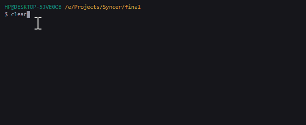

# DirSync

Dirsync is a simple python program to sync/copy/backup directories. DirSync supports filtering files by extensions, directories, size, date. This can be particularly useful to sync/copy files and folders with external hard disk or drives.


## Features
- Three modes:
    - default: copies all files in source that is absent in destination. (Dest = Dest + Src)
    - bidirectional: syncs both source and destination ((Dest = Src) = Dest | Src)
    - strict: copies all source files to destination and delete destination files that are absent in source. (Dest = Src)
- Filters:
    - size: process files in provided size range only 
    - date: process files modified in provided date interval.
    - extension: include or exclude files with provided extensions
    - directories: include or exclude files in provided folders
- Supports absolute path and relative paths
- Deletes files to recycle bin
- Config file to save default preferences

## Usage
- download or clone the dirSync repository
- move it to your src folder (this need not be done if you are using absolute paths)
- install send2trash if you don't have it already.(It is the only third party library used)
```bash
# if you do not have send2trash
$ pip install -r requirements.txt

```
```bash

$ python dirsync.py <src folder> <dest folder> 
```
#### Filters
| argument       | function     |
| :------------- | :----------: |
|  `-s, --strict` | strict mode |
|  `-b, --bidirect` | bidirectional or sync mode | 
|  `--min_size` | files with size above min size is selected (in MB) |
|  `--min_size` | files with size below max size is selected (in MB) | 
|  `--older_than` | files modified before provided date (format=dd/mm/yyyy) |
|  `--newer_than` | files modified after provided date (format=dd/mm/yyyy) | 
|  `--exc_dir` | files in provided directories will be excluded |
|  `--inc_dir` | files only in provided directories will be included | 
|  `--exc_ext` | files with provided extensions will be excluded |
|  `--inc_dir` | files with provided extensions will be included | 

example usage with filters
```bash
$ python dirsync.py src dest --min_size 10 --max_size 200 --older_than 12/12/2020 --exc_ext .pdf .mp4 .mp3 --inc_dir dir1 dir2

```
**Arguments can be provided through config file as well**

## Todo
- [ ] Progress bar for copying
- [ ] New mode which reorder the existing files to source order
